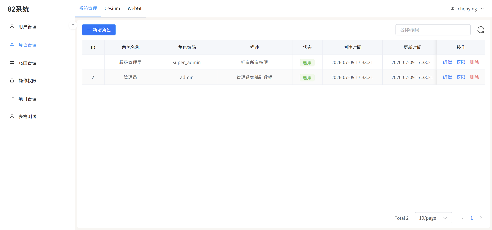
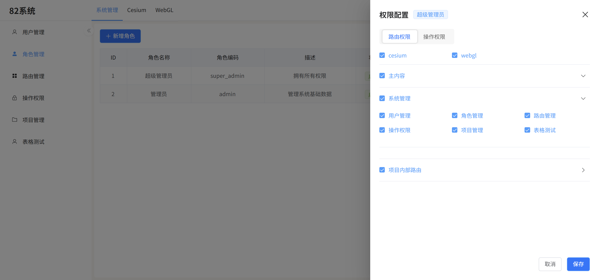
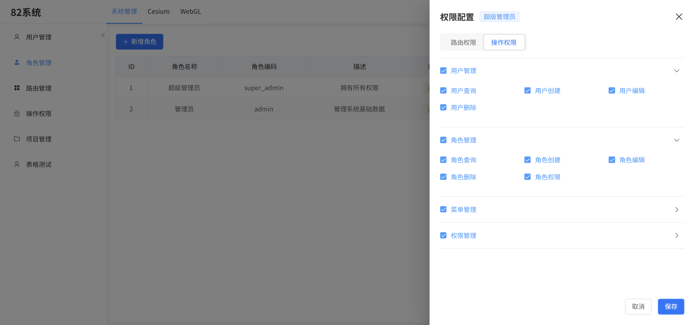
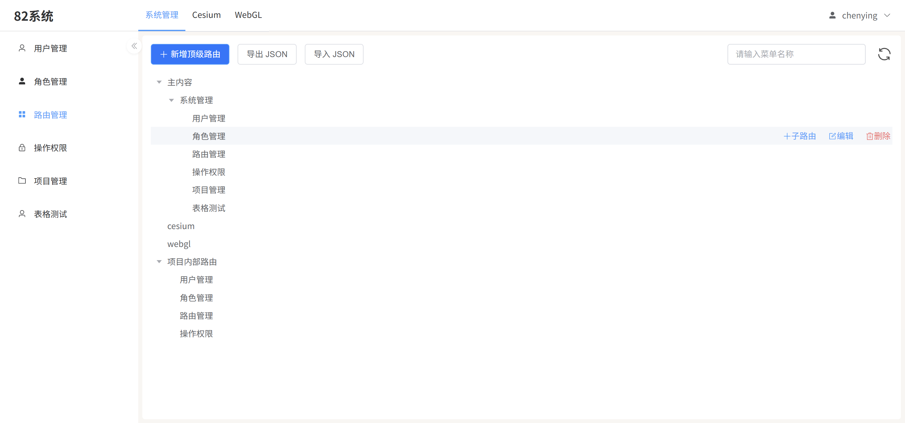
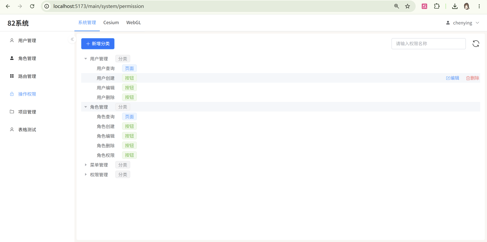
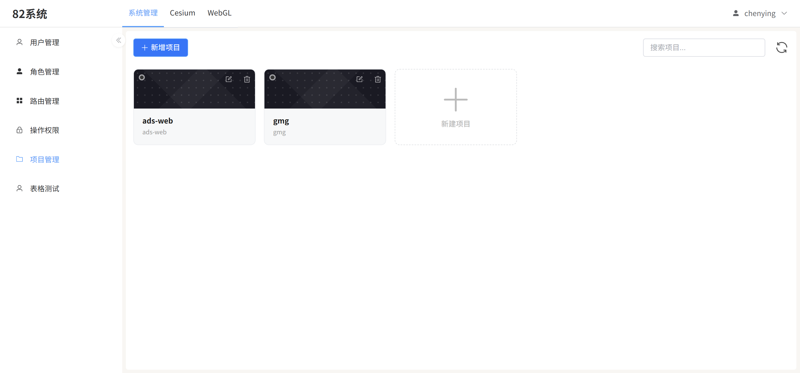
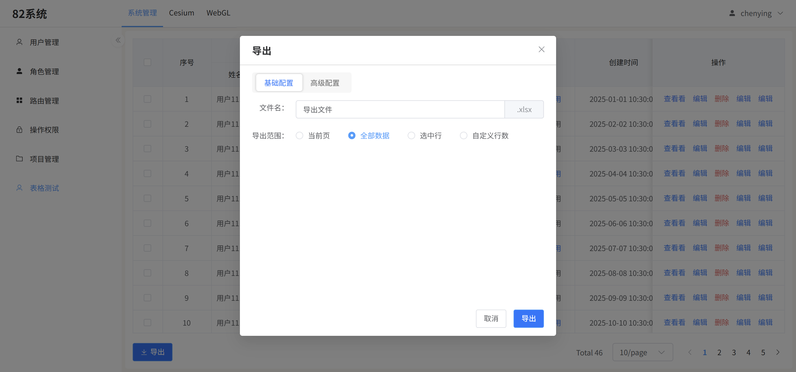
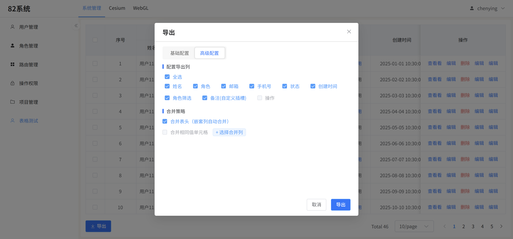

### OA Project

一个前后端分离项目。

### 项目结构

- [前端 Vue](https://github.com/siguhan/oa-project-vue)
- [后端 Spring Boot](https://github.com/siguhan/oa-project-spring)

### 用户管理页面

### 角色管理页面（可以为角色配置路由权限和操作权限）

### 路由管理页面（路由增删改查，图标配置）

### 操作权限页面（操作权限的增删改查）

### 项目管理页面（管理每个项目的用户，角色，权限）

### 表格内置导出组件（可将表格导出为excel）

